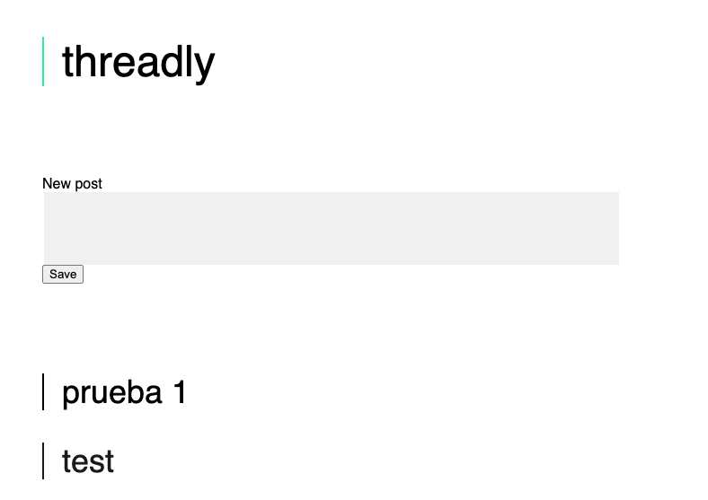

# Threadly

Proyecto simple para iniciantes en Ruby on Rails.

Pasos:

1. Crear un nuevo proyecto de rails llamado `threadly`.
```bash
$ rails new threadly
```

2. Moverse al nuevo directorio en instalar las gemas que se encuentran en el Gemfile.
```bash
$ bundle install
```

6. Generar un controlador llamado `Posts` con las acciones `index` y `create`.
```
$ rails g controller Posts
```
4. Agregue la plantilla para las vista `app/views/posts/index.html.erb`

5. Agregue sus estilos en `app/assets/stylesheets/posts.scss`.

7. Generar un modelo llamado `Post`. 
```bash
$ rails g model Post
```

8. Abra el archivo de migración en `db/migrate/` y agregue una columna de cadena llamada `comment`. Finalmente, corra el comando de migración
```bash
$ rails db:migrate
```

9. En el archivo de rutas, agregue la ruta de recursos para `posts`:
```
resources :posts
```

10. Para ver todas las nuevas URL que creó la ruta de recursos, ingresar lo siguiente en la terminal.
```
$ bundle exec rake routes 
```
¿Qué rutas debemos utilizar? Mirando hacia atrás en el ciclo de solicitud/respuesta, necesitamos una acción de controlador para manejar las solicitudes GET y otra acción de controlador para manejar las solicitudes POST. De acuerdo con la salida de `bundle exec rake routes`, podemos usar:
- `posts#index` para manejar las solicitudes GET mostrando todos los comentarios.
- `posts#create` para gestionar las solicitudes POST guardando una publicación en la base de datos.

11. Configuraremos la acción `posts#index` del controlador para manejar las solicitudes GET. Usaremos `@new_post` en la vista para representar un formulario. Usaremos `@all_posts` para mostrar una lista de todas las publicaciones, ordenadas en orden descendente.
```ruby
def index
    @new_post = Post.new
    @all_posts = Post.order(created_at: :desc).all
end

```

12. Dentro de `app/views/posts/index.html.erb`, cree un formulario de Rails con los campos `@new_post`. Así mismo, liste todos los posts guardados usando `@all_posts`.

13. En el archivo de rutas, establezca la acción `posts#index` como la ruta raíz.

14. Configuraremos la acción `posts#create` del controlador para manejar las solicitudes POST. En el controlador `Posts`, escribe un método privado llamado `signup_params`:
```ruby
private
def signup_params
    params.require(:post).permit(:email)
end
```

15. En el mismo controlador, adapte la acción `create`. Utilice signup_params para recopilar datos del formulario de forma segura y actualizar la base de datos. 
```ruby
def create
    @post = Post.new(post_params)
    @post.save
    redirect_to root_path
end
```

16. Inicie su servidor Rails.
```bash
$ rails s -p PORT_NUMBER
```

17. Para visualizar los emails agregados, ejecute lo siguiente en una nueva terminal
```bash
rails console
```

18. Luego ingrese `Post.all` en la nueva consola y veras los resultados asociados a la tabla.

